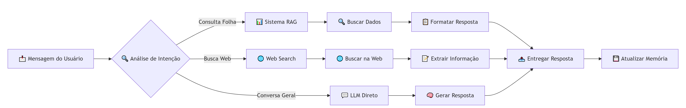

# 🤖 Chatbot Folha de Pagamento  

**Aplicação online:** [Chatbot Folha de Pagamento](https://chatbotpayroll-eptmrmbmrb52zahgcb5knp.streamlit.app/)

Um chatbot inteligente para consulta de **folha de pagamento (payroll)** — o conjunto de registros salariais de colaboradores, incluindo salários, bônus e descontos.  
O sistema permite consultar informações salariais de forma simples, automatizada e segura, utilizando **técnicas de RAG (Retrieval-Augmented Generation)** e **processamento de linguagem natural (NLP)**.  

---

## 🎯 Objetivo e Justificativa  

O projeto foi desenvolvido para **automatizar consultas de folha de pagamento**, reduzindo o tempo de resposta do RH e melhorando a transparência com os funcionários.  

### 🧠 Justificativas Técnicas  
- Utiliza o modelo **GPT-3.5-Turbo** (LLM livre da OpenAI), escolhido pelo **baixo custo, estabilidade e excelente desempenho** em tarefas de linguagem.  
- A arquitetura **RAG (Retrieval-Augmented Generation)** garante **respostas precisas e contextualizadas** com base nos dados reais da folha.  
- O **Pandas** foi adotado para manipulação e análise eficiente dos dados salariais, pela sua **performance, flexibilidade e ampla adoção no ecossistema de dados em Python**.  
- Estrutura modular em **Python (3.11.9)** facilita **testes, manutenção e escalabilidade**.  
-  **FastAPI**-Testabilidade: Estrutura que facilita a criação de testes unitários e de integração e alta perfomance.
<p align="center">
  
</p>

## ⚙️ Execução Local  

### 1️⃣ Clonar o repositório  
```bash
git clone https://github.com/Denilza/chatbot_payroll.git
cd chatbot_payroll

# 2. Venv
python -m venv venv
venv\Scripts\activate  # Windows
source venv/bin/activate  # Linux/Mac

# 3. Instalar
pip install -e .

# 4. Executar
streamlit run streamlit_app.py

🎯 Como Usar
Acesse a aplicação no navegador: http://localhost:8501

Faça perguntas em linguagem natural sobre folha de pagamento

Visualize evidências expandindo a seção "Ver Evidências"

Exporte dados usando o botão de download JSON

🔧 Configuração de Desenvolvimento
Variáveis de Ambiente
env
SERPER_API_KEY=sua_chave_api_serper
OPENAI_API_KEY=sua_chave_openai
LOG_LEVEL=INFO
Desenvolvimento Local
bash

# Desenvolvimento
pip install -r requirements-dev.txt
streamlit run streamlit_app.py

🧪 Executando Testes

Os testes unitários estão localizados na pasta tests/.
Para executá-los, use:

pytest -v


### Backend (FastAPI):
```bash
python -m app.main

Acesse: http://localhost:8000/docs
### 1. Chat - Processamento de consultas
```bash
$ curl -X POST http://localhost:8000/chat \
>   -H "Content-Type: application/json" \
>   -d '{"message": "Quanto recebi em maio/2025? (Ana Souza)"}'
{"response":"ana souza recebeu R$ 8.418,75 em maio de 2025.","evidence":[{"employee_id":"E001","name":"Ana Souza","competency":"2025-05","net_pay":8418.75,"payment_date":"2025-05-28","base_salary":8000.0,"bonus":1200.0,"deductions_inss":880.0,"deductions_irrf":551.25}],"sources":["payroll.csv"],"conversation_id":"default"}(venv)

$ curl -X POST "http://localhost:8000/chat" \
>   -H "Content-Type: application/json" \
>   -d '{"message": "Quais foram os descontos de INSS e IRRF do Bruno em janeiro 2025"}'
{"response":"O desconto de **INSS** de **bruno lima** em Janeiro/2025 foi R$ 660,00.","evidence":[{"employee_id":"E002","name":"Bruno Lima","competency":"2025-01","net_pay":6095.0,"payment_date":"2025-01-28","base_salary":6000.0,"bonus":500.0,"deductions_inss":660.0,"deductions_irrf":345.0}],"sources":["payroll.csv"],"conversation_id":"default"}  

$ curl -X POST "http://localhost:8000/chat" \
>   -H "Content-Type: application/json" \
>   -d '{"message": "Data pagamento Bruno abril 2025"}'
{"response":"O salário de **bruno lima** foi pago em 28/04/2025, e o líquido recebido foi R$ 5.756,25.","evidence":[{"employee_id":"E002","name":"Bruno Lima","competency":"2025-04","net_pay":5756.25,"payment_date":"2025-04-28","base_salary":6000.0,"bonus":0.0,"deductions_inss":660.0,"deductions_irrf":333.75}],"sources":["payroll.csv"],"conversation_id":"default"}


### 🧩 Monitoramento, Observabilidade e Guardrails

O projeto foi pensado em boas práticas de **observabilidade** e **controle de qualidade** das respostas do chatbot.

- 📜 **Observabilidade:**
  O módulo `observability.py` registra logs estruturados e métricas de uso, permitindo acompanhar o desempenho e detectar falhas durante a execução.  
- 🛡️ **Guardrails:**
  Aplicados para garantir segurança e confiabilidade das respostas geradas, evitando saídas fora de contexto ou que violem políticas do sistema.

## Futuras melhorias

- **Web Search:** buscar informações externas quando os dados internos não forem suficientes.  
- **Suporte a múltiplos formatos de dados:** Excel, CSV ou ERP.  
- **Dashboard e relatórios:** análise de consultas e desempenho do chatbot.  
- **Autenticação e permissões:** acesso seguro a informações confidenciais.  
- **Notificações e alertas automáticos** sobre folha de pagamento.  
- **Versão mobile ou PWA** e suporte a múltiplos idiomas.


📞 Suporte
Para dúvidas e suporte:

📧 Email: denilzalimas@gmail.com

🤝 Contribuição
Este projeto está em constante evolução! Contribuições são bem-vindas:

Fork o projeto

Crie uma branch para sua feature (git checkout -b feature/nova-feature)

Commit suas mudanças (git commit -am 'Adiciona nova feature')

Push para a branch (git push origin feature/nova-feature)

Abra um Pull Request


📝 Licença
Este projeto está sob a licença MIT. Veja o arquivo LICENSE para detalhes.

# chatbot_payroll
